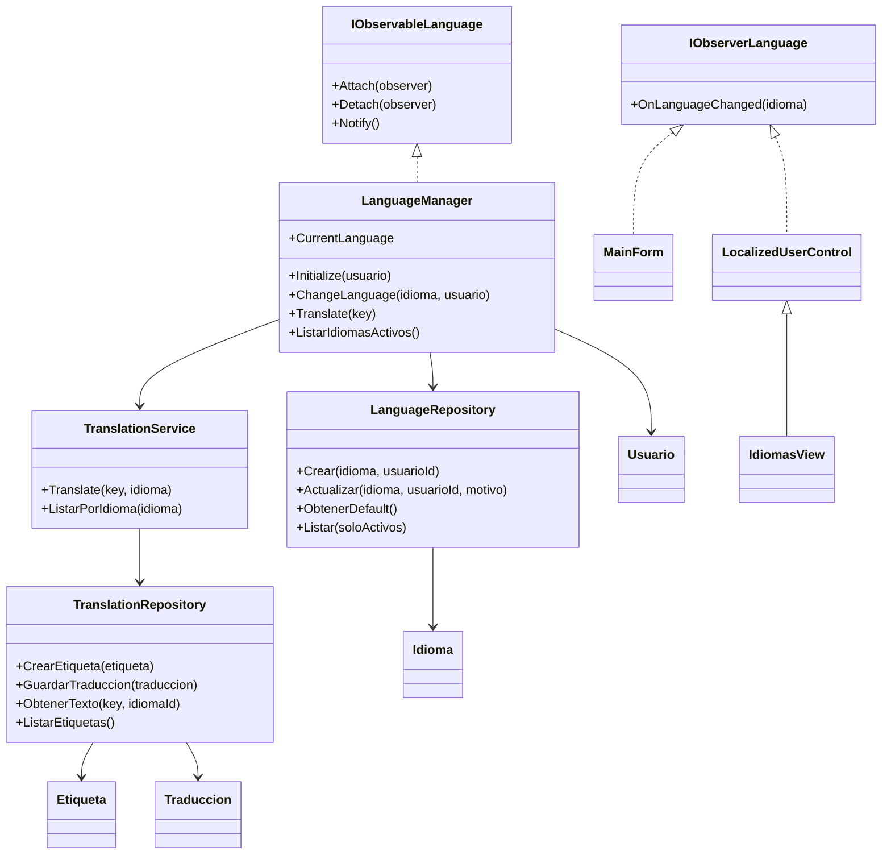
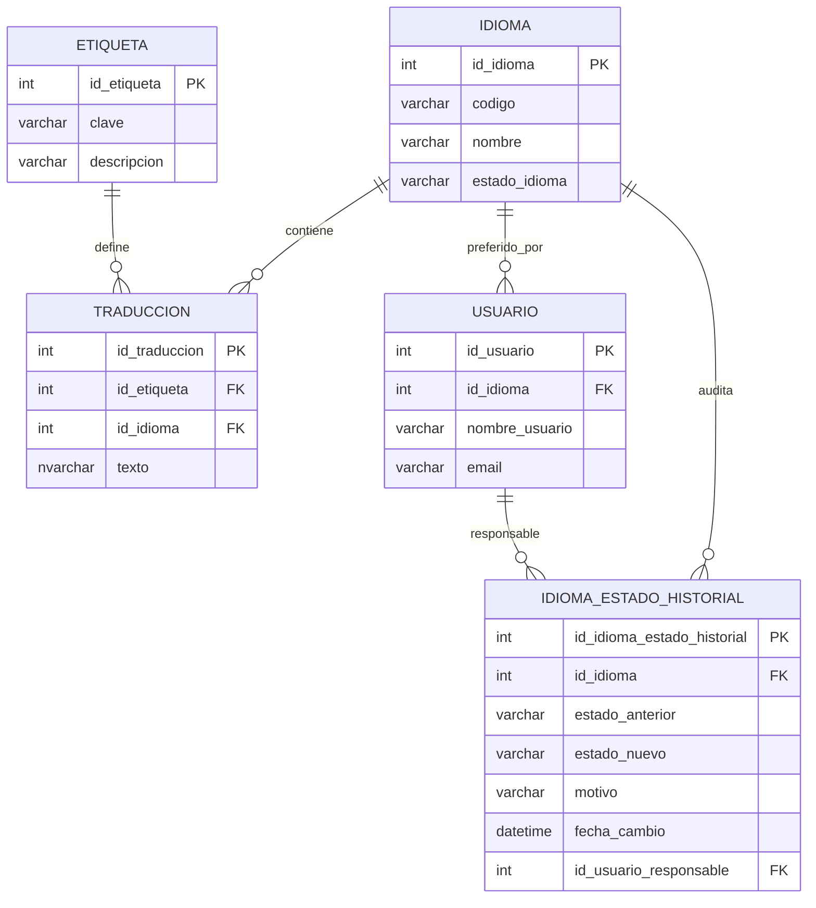
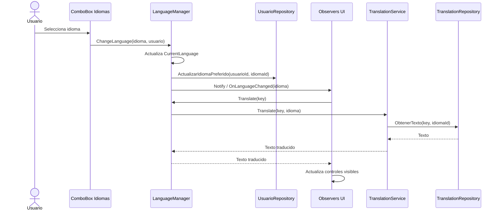

# Sistema de gestion dinamica de idiomas

## Analisis de la solucion

La solucion implementa i18n sin usar archivos estaticos como fuente principal. Los idiomas, etiquetas y traducciones se guardan en la base de datos y se administran desde la pantalla `Idiomas`.

El cambio de idioma se resuelve con Observer:

- Observable/Subject: `LanguageManager`.
- Observers: `MainForm` y las vistas que heredan de `LocalizedUserControl`.
- Servicio de traduccion: `TranslationService`.
- Persistencia: `LanguageRepository`, `TranslationRepository` y `UsuarioRepository`.

Cada texto visible se identifica con una clave estable, por ejemplo `BTN_SAVE`. La UI no conoce las traducciones ni llama a otras pantallas; solo se suscribe al manager y vuelve a pedir sus textos cuando recibe la notificacion.

## Funcionamiento

1. Al iniciar sesion, `LanguageManager.Initialize(usuario)` busca `Usuario.IdiomaPreferidoId`.
2. Si el usuario no tiene idioma preferido o esta inactivo, se usa el idioma activo por defecto.
3. El selector de idioma muestra idiomas activos desde BD.
4. Al cambiar el selector, `LanguageManager.ChangeLanguage(idioma, usuario)` actualiza el idioma actual.
5. Si hay usuario autenticado, se persiste `Usuario.id_idioma`.
6. `LanguageManager.Notify()` avisa a todos los observers.
7. Cada observer vuelve a pedir traducciones con `LanguageManager.Translate(key)`.
8. La UI se actualiza en tiempo de ejecucion sin reiniciar.

## Clases principales

## DER

## Secuencia de cambio de idioma

## Extension

Para agregar un nuevo idioma no se recompila:

1. Crear idioma desde la pantalla `Idiomas`.
2. Activarlo.
3. Crear o seleccionar etiquetas.
4. Agregar traducciones por idioma.
5. El idioma aparece en el selector si esta activo.

La activacion/desactivacion queda persistida en `Idioma.estado_idioma` y documentada en `IdiomaEstadoHistorial`.
